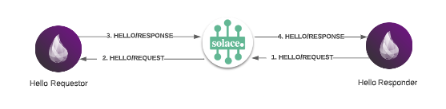
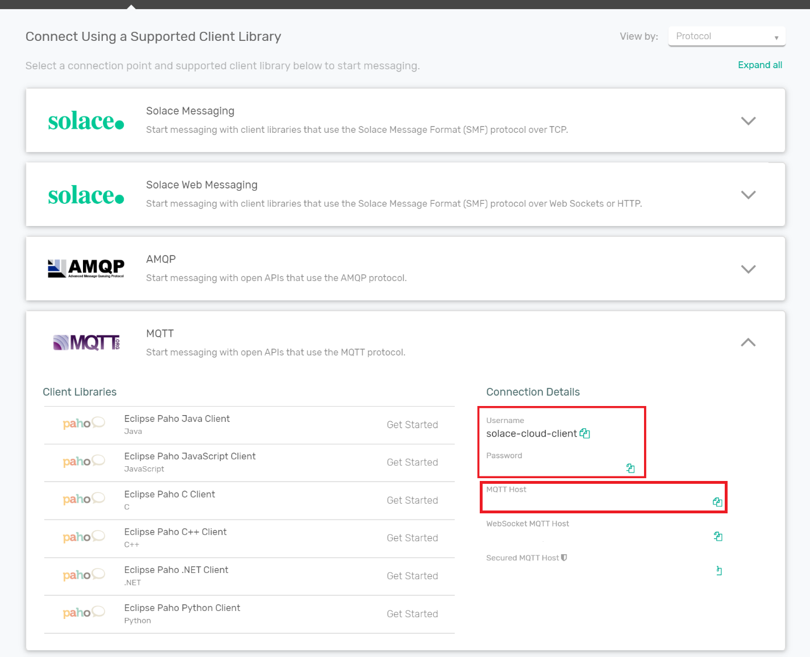

# Elixir-Solace

This project demonstrates integration between Elixir and the [Solace PubSub+ Event Broker](https://www.solace.com).

The project implements a workflow as follows:



## How to run

1. [Install Elixir](https://elixir-lang.org/install.html)

2. [Sign up](https://docs.solace.com/Cloud/ggs_create_first_service.htm) for a Solace PubSub+ Cloud Messaging Service for free

3. Modify config/config.exs with the mqtt host/credentials from the connections tab in your Solace PubSub+ Cloud Service as shown below: 
    

4. Run the following command to start the responder
```
  $ iex -S mix
  iex(1)> Solace.Hello.Responder.start_connection
```
You should see the following output:
```
[info] Succesfully connected!
 
[info] Succesfully subscribed to hello/request!
```


